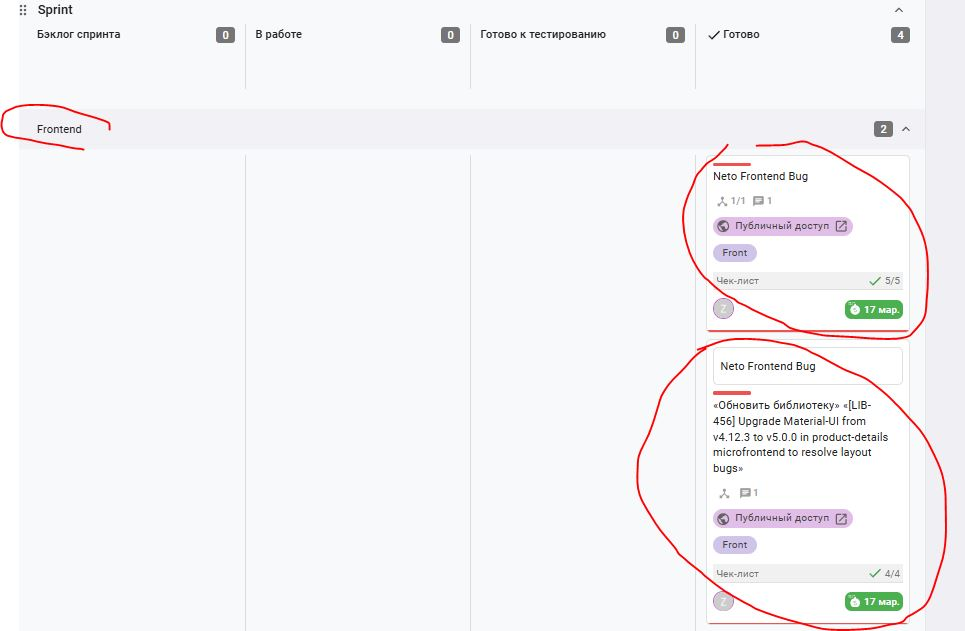

# netorep
## Домашнее задание к занятию 11 «Teamcity»

## Подготовка к выполнению
### В Yandex Cloud создано 3 сервера.

### Создан nexus сервер из указанного playbook.

https://zhelanov.kaiten.ru/62002224  
https://zhelanov.kaiten.ru/p/c/cb39d67d-365c-4746-abcb-56f4c759feb5   
https://zhelanov.kaiten.ru/62053603  
https://zhelanov.kaiten.ru/p/c/958f97bc-91ef-46f4-81f0-6cd6bf11850a  

 
